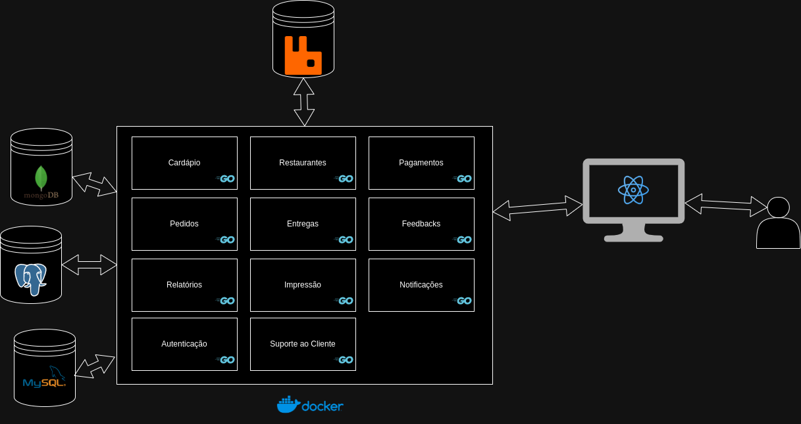

### Arquitetura de Microsserviços

The application will be divided into several microservices, each responsible for a specific part of the system:

1. **Restaurant Microservice**
2. **Order Microservice**
3. **Delivery Microservice**
4. **Payment Microservice**
5. **Review Microservice**
6. **Menu Microservice**
7. **Printing Microservice**
8. **Reporting Microservice**
9. **Notification Microservice**
10. **Authentication Microservice**
11. **Customer Support Microservice**

